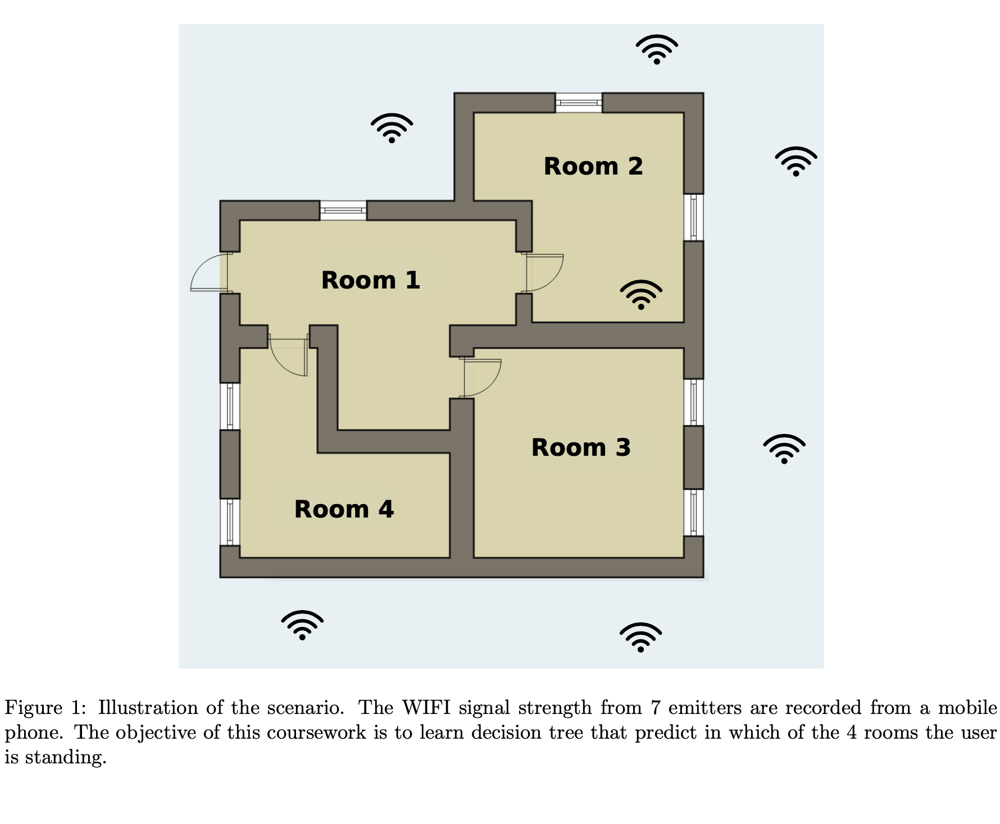

# Decision Tree

This is the code for Decision Tree Learning coursework which has been implemented in Numpy. The decision tree algorithm was used to determine one of the indoor locations based on WIFI signal strengths collected from a mobile phone. 
See below for the illustration of the experimental scenario. Where functions operations are not obvious by their names, I have included a doc string in the function.




## Files included

1. **wifi db**: This folder contains the clean and noisy data files in txt format as provided for the coursework.

2. **EDA.py (ExploratoryDataAnalysis)** :This script has some analysis run on both the clean data and the noisy data. This collates and outputs some statistics about each dataset and each signal. 


3. **Nodes.py**: This contains the Node class which we create and contains all the node methods. The Node class is very intertwined with the class below so have not included any testing here.

4. **Trees.py**: This contains the DecisionTree class which contains all the node methods. 

5. **Evaluation functions.py**: This contains all the functions for evaluating the performance of the trees. It also hosts the function for pruning a tree called prune tree and the functions for aggregating evaluation metrics like accuracy, precision and F1s.

6. **Main.py**: A number of commands for evaluation and they generate the metrics we put into our report. We have done the below:

## Run Locally

Clone the project

```bash
  git clone https://github.com/Uokoroafor/Decision_Tree.git
```

Go to the project directory

```bash
  cd Decision_Tree
```

Install dependencies

```bash
  pip install -r requirements.txt
```


## Usage/Examples

```python
# Imports: Please first run the commands. Note that running these commands will automatically import numpy as np and numpy.random as default rng. This allows for seeding randomness if required:
from Trees import *
from Nodes import *
from Evaluation_functions import *

# Load dataset
noisy_data = np.loadtxt(’wifi_db/noisy_dataset.txt’)

# Split data: Create a test and training set from a loaded dataset. 
# Note that test proportion is set by default to 10% (0.1) but can be set between 0 and 1.
noisy_train, noisy_test = train_test_split(noisy_data, test_proportion=0.1)

# To create a decision tree with depth 10
noisy_tree = decision_tree_learning(noisy_train,  max_depth = 10)

# 10-fold cross-validation: 
noisy_cv = get_cv_metrics(noisy_data)

# Prune a tree
pruned_tree=prune_tree(test_data, noisy_tree)

# To perform nested cross validation
noisy_nested_cv = get_nested_cv_metrics(noisy_data, prints=False)
```

